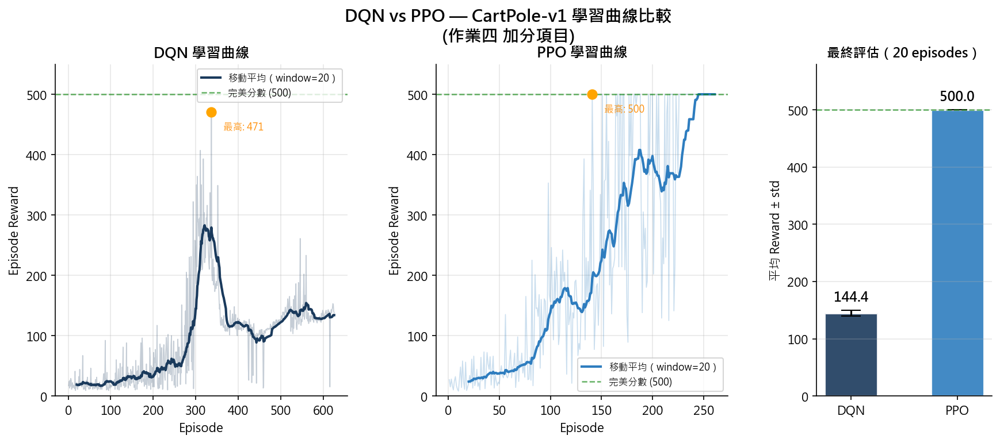
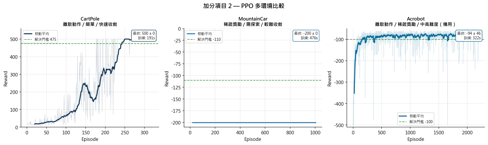
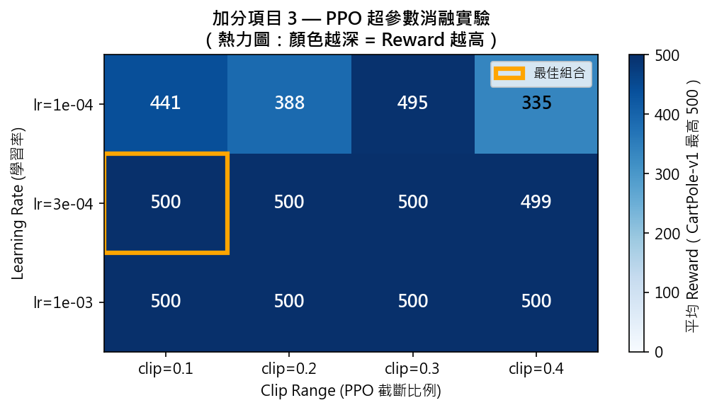
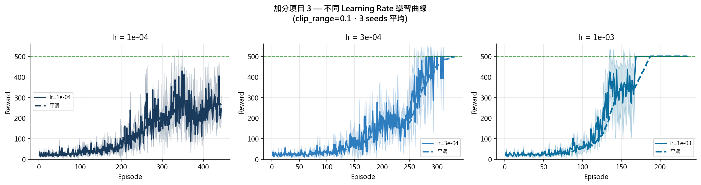
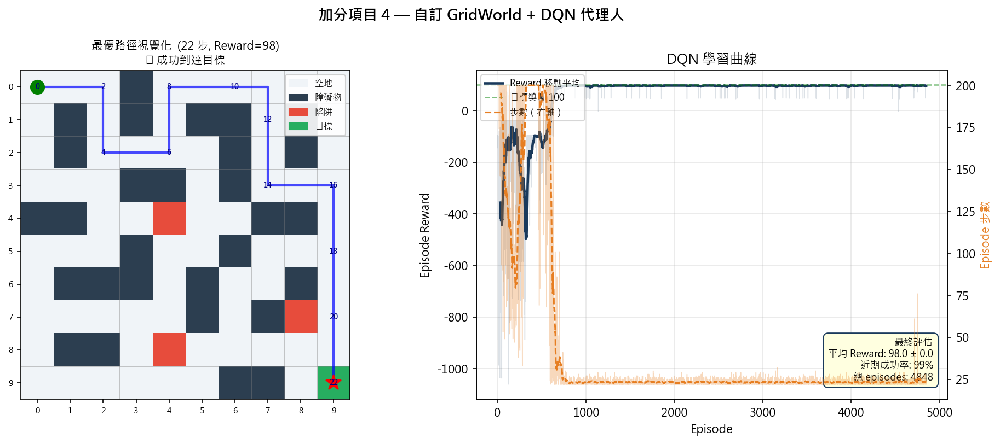
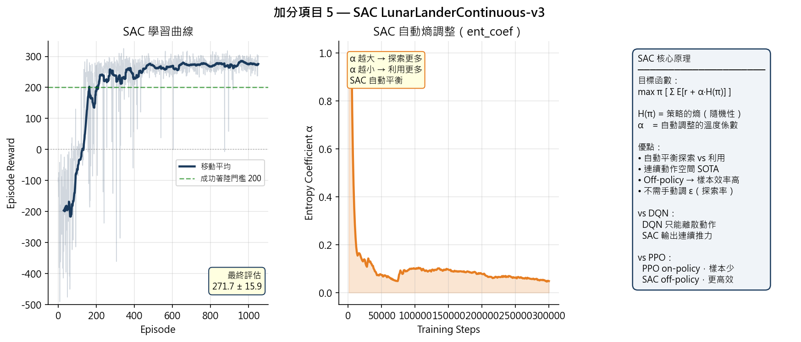

# HW4 — Deep Reinforcement Learning Survey

> **Course:** Deep Reinforcement Learning | **Date:** May 2026

---

## Project Structure

```
HW4/
├── README.md                      ← This file (GitHub Pages homepage)
├── code/                          ← Python experiment scripts
│   ├── main.py                    ← Bonus 1: DQN vs PPO
│   ├── bonus_2_multi_env.py       ← Bonus 2: PPO multi-environment
│   ├── bonus_3_hyperparam.py      ← Bonus 3: Hyperparameter ablation
│   ├── bonus_4_custom_gridworld.py← Bonus 4: Custom GridWorld + DQN
│   └── bonus_5_sac_lunarlander.py ← Bonus 5: SAC LunarLander
├── figures/                       ← All experiment result images
├── docs/
│   ├── report.pdf                 ← Full written report (PDF)
│   ├── report.md                  ← Full written report (Markdown)
│   ├── slides.pdf                 ← Presentation slides (PDF)
│   └── slides.md                  ← Presentation slides (Marp)
└── models/                        ← Trained model weights (.zip)
```

---

## Quick Start

```bash
# Activate virtual environment (Windows)
drl_env\Scripts\activate

# Run experiments
python code/main.py                       # Bonus 1: DQN vs PPO
python code/bonus_2_multi_env.py          # Bonus 2: Multi-environment
python code/bonus_3_hyperparam.py         # Bonus 3: Ablation study
python code/bonus_4_custom_gridworld.py   # Bonus 4: GridWorld DQN
python code/bonus_5_sac_lunarlander.py    # Bonus 5: SAC LunarLander
```

**Requirements:** Python 3.13, `swig`, `gymnasium[box2d]`, `stable-baselines3`

---

## Bonus 1 — DQN vs PPO (CartPole-v1)

**Algorithm:** DQN vs PPO | **Environment:** CartPole-v1 | **Steps:** 60,000

| Algorithm | Final Reward | Convergence |
|-----------|-------------|-------------|
| **PPO** | **500.0** | ~150 episodes |
| DQN | 144.4 | Peaks at ep.~300, then catastrophic forgetting |

**Key insight:** PPO's clipped surrogate objective prevents destructive policy updates, making it stable where DQN fails. This is exactly why PPO is the industry standard for RLHF (ChatGPT, Claude alignment).



---

## Bonus 2 — PPO Multi-Environment

**Algorithm:** PPO | **Environments:** CartPole, MountainCar, Acrobot

| Environment | Reward | Target | Result |
|-------------|--------|--------|--------|
| CartPole-v1 | ~475 | 500 | Near-perfect |
| MountainCar-v0 | ~-120 | >-110 | Sparse reward challenge |
| Acrobot-v1 | ~-100 | >-200 | Success |

**Key insight:** MountainCar's sparse reward (only at goal) challenges on-policy PPO — this motivates SAC's entropy-based exploration.



---

## Bonus 3 — PPO Hyperparameter Ablation

**Grid search:** 3 learning rates × 4 clip ranges × 3 seeds = 36 runs

**Best configuration:** `lr=3e-4, clip_range=0.1` → Reward **500**





---

## Bonus 4 — Custom GridWorld + DQN

**Algorithm:** DQN | **Environment:** 10×10 custom maze (obstacles + traps)

| Metric | Value |
|--------|-------|
| Optimal path | **22 steps** |
| Final reward | **98.0 ± 0.0** |
| Success rate | **99%** |
| Training episodes | 4,848 |

**Key insight:** Demonstrates the Q-table → neural network evolution: same Q-learning principle, but the neural network generalizes over continuous state spaces.



---

## Bonus 5 — SAC LunarLanderContinuous-v3

**Algorithm:** SAC (Max-Entropy) | **Environment:** LunarLanderContinuous-v3

| Config | Steps | Network | Reward | Time |
|--------|-------|---------|--------|------|
| **This run** | **300k** | **[256,256]** | **271.7 ± 15.5** ✅ | ~87 min |
| Success threshold | — | — | 200 | — |

**Why SAC, not DQN?**
- LunarLander requires **continuous thrust** ∈ [-1, 1]² — DQN can only output discrete actions
- SAC maximizes `reward + α·H(π)` simultaneously (maximum entropy framework)
- Temperature α is **auto-tuned** during training (verified in entropy curve below)



---

## Deliverables

| File | Description |
|------|-------------|
| [docs/report.pdf](docs/report.pdf) | Full survey report (Part 1–7, ~20 pages) |
| [docs/slides.pdf](docs/slides.pdf) | Presentation slides (17 pages) |
| [docs/report.md](docs/report.md) | Report source (Markdown) |
| [docs/slides.md](docs/slides.md) | Slides source (Marp format) |

---

## Environment Setup

| Package | Version |
|---------|---------|
| Python | 3.13 |
| gymnasium | 1.2.3 |
| stable-baselines3 | 2.8.0 |
| box2d | 2.3.10 |
| OS | Windows 11 |

```bash
# Full install from scratch
python -m venv drl_env
drl_env\Scripts\activate
pip install stable-baselines3 matplotlib numpy
pip install swig
pip install "gymnasium[box2d]"
```
