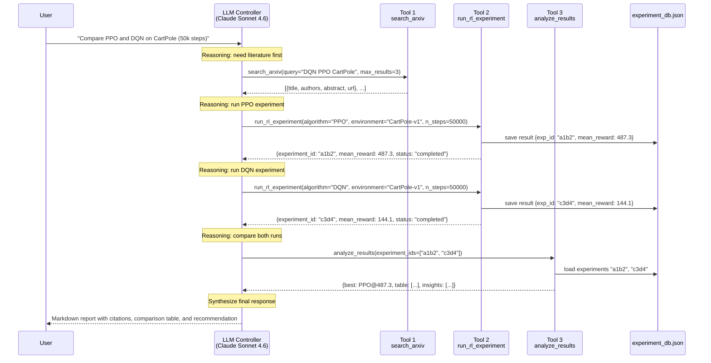

# DRL Research Assistant — System Infographic

> Render this file in any Markdown viewer (GitHub, Obsidian, VS Code).  
> Mermaid diagrams render natively on GitHub and in most modern editors.

---

## 1. System Architecture Overview

```
╔══════════════════════════════════════════════════════════════════╗
║                DRL RESEARCH ASSISTANT — AI HARNESS               ║
╚══════════════════════════════════════════════════════════════════╝

  ┌─────────────────────────────────────┐
  │           USER (Researcher)          │
  │  "Compare PPO and DQN on CartPole"  │
  └──────────────┬──────────────────────┘
                 │ natural language query
                 ▼
  ╔══════════════════════════════════════╗
  ║      LLM CONTROLLER                  ║
  ║      Claude Sonnet 4.6               ║
  ║                                      ║
  ║  1. Parse intent                     ║
  ║  2. Reason about tool sequence       ║
  ║  3. Call tools (function calling)    ║
  ║  4. Evaluate results                 ║
  ║  5. Synthesize final response        ║
  ╚════════╤════════════╤════════════════╝
           │            │
    ┌──────┘            └──────────────────────────┐
    │                                              │
    ▼                    ▼                         ▼
  ┌──────────┐    ┌─────────────────┐    ┌──────────────────┐
  │ TOOL 1   │    │    TOOL 2       │    │    TOOL 3        │
  │          │    │                 │    │                  │
  │ search_  │    │ run_rl_         │    │ analyze_         │
  │ arxiv()  │    │ experiment()    │    │ results()        │
  │          │    │                 │    │                  │
  │ ArXiv    │    │ Stable-         │    │ experiment_      │
  │ HTTP API │    │ Baselines3 +    │    │ db.json          │
  │          │    │ Gymnasium       │    │ (persistent)     │
  └────┬─────┘    └───────┬─────────┘    └────────┬─────────┘
       │                  │                        │
       └──────────────────┴────────────────────────┘
                          │
                          ▼
  ╔══════════════════════════════════════╗
  ║           MEMORY SYSTEM              ║
  ║                                      ║
  ║  Short-term: LLM context window      ║
  ║  (conversation history, tool results)║
  ║                                      ║
  ║  Long-term: experiment_db.json       ║
  ║  (rewards, timestamps, hyperparams)  ║
  ╚══════════════════════════════════════╝
                          │
                          ▼
  ┌─────────────────────────────────────┐
  │           USER (Researcher)          │
  │  Markdown report with citations,     │
  │  comparison table, and insights      │
  └─────────────────────────────────────┘
```

---

## 2. Function Calling / Tool Chain Flow (Sequence Diagram)



---

## 3. ReAct Orchestration Loop

```
┌──────────────────────────────────────────────────────────────┐
│                    ReAct Loop (per query)                     │
│                                                               │
│   ┌─────────┐     ┌──────────┐     ┌─────────────┐          │
│   │  START  │────▶│  REASON  │────▶│  ACT        │          │
│   │         │     │          │     │ (tool call) │          │
│   │ User    │     │ LLM text │     │             │          │
│   │ query   │     │ block    │     │ Tool result │          │
│   └─────────┘     └──────────┘     └──────┬──────┘          │
│                        ▲                  │                   │
│                        │ more tools?      │                   │
│                        └──────────────────┘                   │
│                                   │ stop_reason = "end_turn"  │
│                                   ▼                           │
│                         ┌──────────────────┐                  │
│                         │  FINAL RESPONSE  │                  │
│                         │  (text to user)  │                  │
│                         └──────────────────┘                  │
└──────────────────────────────────────────────────────────────┘
```

---

## 4. Tool Input / Output Summary

```
┌─────────────────────────────────────────────────────────────────┐
│  Tool 1: search_arxiv                                           │
│  ┌─────────────────────┐    ┌──────────────────────────────┐   │
│  │ INPUT               │    │ OUTPUT                       │   │
│  │ • query: str        │───▶│ • papers[]: {title, authors, │   │
│  │ • max_results: int  │    │   abstract, url, published}  │   │
│  └─────────────────────┘    │ • count: int                 │   │
│                             └──────────────────────────────┘   │
├─────────────────────────────────────────────────────────────────┤
│  Tool 2: run_rl_experiment                                      │
│  ┌─────────────────────┐    ┌──────────────────────────────┐   │
│  │ INPUT               │    │ OUTPUT                       │   │
│  │ • algorithm: str    │───▶│ • experiment_id: str         │   │
│  │ • environment: str  │    │ • mean_reward: float         │   │
│  │ • n_steps: int      │    │ • std_reward: float          │   │
│  │ • hyperparams: dict │    │ • status: "completed"|"failed"│   │
│  └─────────────────────┘    │ • timestamp: str             │   │
│                             └──────────────────────────────┘   │
├─────────────────────────────────────────────────────────────────┤
│  Tool 3: analyze_results                                        │
│  ┌─────────────────────┐    ┌──────────────────────────────┐   │
│  │ INPUT               │    │ OUTPUT                       │   │
│  │ • experiment_ids[]  │───▶│ • comparison_table[]         │   │
│  │ • metrics[]         │    │ • best_experiment: dict      │   │
│  └─────────────────────┘    │ • insights: list[str]        │   │
│                             └──────────────────────────────┘   │
└─────────────────────────────────────────────────────────────────┘
```

---

## 5. Memory Architecture

```
┌─────────────────────────────────────────────────────────────────┐
│                        MEMORY SYSTEM                            │
│                                                                 │
│  ┌───────────────────────────────────────┐                      │
│  │  SHORT-TERM (in-context)              │  ← lost on restart   │
│  │                                       │                      │
│  │  [User] "Compare PPO and DQN"         │                      │
│  │  [Tool Result] {mean_reward: 487.3}   │                      │
│  │  [Assistant] "PPO outperforms DQN..." │                      │
│  │                                       │                      │
│  │  Max size: ~200k tokens (context)     │                      │
│  └───────────────────────────────────────┘                      │
│                                                                 │
│  ┌───────────────────────────────────────┐                      │
│  │  LONG-TERM (persistent JSON)          │  ← survives restart  │
│  │                                       │                      │
│  │  experiment_db.json:                  │                      │
│  │  {                                    │                      │
│  │    "a1b2c3d4": {                      │                      │
│  │      algorithm: "PPO",               │                      │
│  │      environment: "CartPole-v1",     │                      │
│  │      mean_reward: 487.3,             │                      │
│  │      timestamp: "2026-05-20T..."     │                      │
│  │    },                                │                      │
│  │    "e5f6g7h8": { ... }               │                      │
│  │  }                                   │                      │
│  └───────────────────────────────────────┘                      │
└─────────────────────────────────────────────────────────────────┘
```
